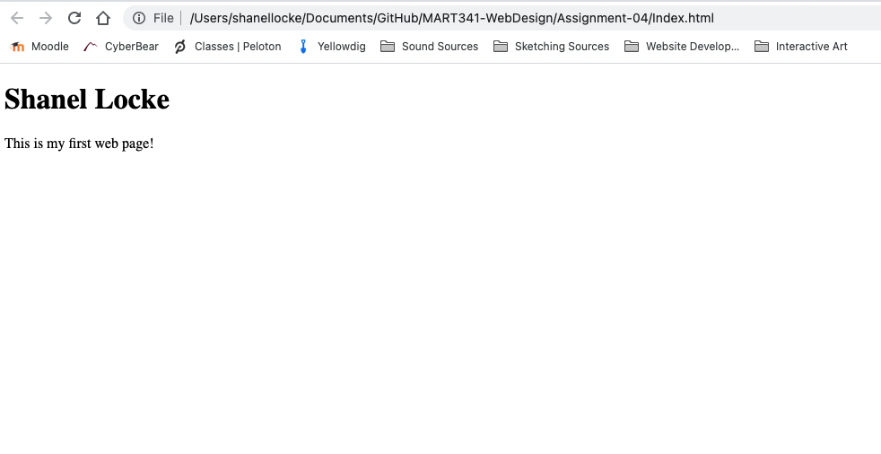

# **Assignment 4**

### 10. Take a screenshot to commemorate this achievement, name it properly, and place it in assignment04/images/.
**Screenshot**

### 13. Very briefly detail how browsers function. List any browsers you currently use to surf - or even develop for - the web.
Used to access the internet from any device. Browsers are used to display web pages.

**This is how a browser functions:**
1. User interfaces are the display you interact with.
2. Rendering engines are used to display the visual information.
3. Browser engines decides actions.
4. Communicates over the network to request certain content.
5. Interactive logic and functionality is used via Javascript to communicate.  Each browser must have their own Javascript interpretter.
6. Data storage via cookies or local storage.

**Browsers I Currently Use:**
* Chrome
* Safari

### 14. What is a markup language? Describe one commonly used in development.
Used to format the text for displaying itself on a website.  HTML has been commonly used in this class and is used in a lot of development in general.
